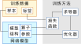

本文为[MegEngine系列](/tags/megengine/)开篇，难得有机会写一些能公开发出来，又和自己平时工作高度相关的内容，期望下次更新不要再鸽一年了。

作为开篇，我会写一点点<ruby>深度学习<rt>炼丹</rt></ruby>的基本概念，然后讲一个有意思的小实验: 如何用 MegEngine 拟合一个 "OVERFIT" 出来。

<!--more-->

## 关于 MegEngine

[MegEngine][MegEngine] 是旷视主导开发的一个开源深度学习框架，它的前身 [MegBrain][gh-mgb] 自 2014 年开始开发，[设计先进][kai-zhihu]，
2015 年起旷视几乎每个炼丹师在每个业务上都在用，并且经受住了各种奇怪生产场景的考验，相当靠谱。
2019 年底，公司决定将 MegBrain 开源，开源版产品进行了重新整合， 更名为 MegEngine。
它的 Python 前端经过完全重新设计，更加合理，也和<ruby>主流框架<rt> PyTorch </rt></ruby>更接近，上手更容易一些。

由于老 MegBrain 是个纯静态图框架，MegEngine 则主推动态图，整个 2020 年，开发团队对于如何做好“动静合一”经过了多次大重构，直到 2020 年 11 月才收敛底层设计。
再经过两个月施工, 最近发布的 [1.2 版][mge-1.2] 的动态图部分完成度已经相当高，旷视内部的一些生产应用也开始逐渐向 MegEngine 迁移。关于这部分具体的设计和实现，
可以参考[xxr3376](https://github.com/xxr3376) 在[某次Tunight][mge-tunight] 的分享和[MegEngine 团队的技术博客][mge-share]。


## 炼丹基本概念

{{}}

在 MegEngine 的概念体系中，一个典型的神经网络模型训练的基本流程如图 1 所示，俗称炼丹三要素:
- **灵材**: 也就是训练数据，在机器学习问题中，数据就定义了问题本身。在有监督学习中，一般需要由 _待测样本_ 和 _监督标签_ 组成的成对训练数据。
- **丹方**: 常被称为“模型”或“网络”，它定义了数据的变换形式，在 MegEngine 中，模型总体上分成以下三个要素:
    - 算子: 数据变换的基本操作，是模型中的“动词”，比如加减乘除、卷积等等
    - 参数: 参与数据变换运算的参数，例如卷积的权重等，它和样本特征一起组成了模型中的“名词”
    - 结构: 定义模型中的动词和名词如何连接，也就是数据如何流动的
      - 如果把模型中的动词、名词作为节点，数据流动关系定义为边，这显然是一个图结构
      - 如果图是在运行前定义好的，运行时只需要把数据输入进图里，这种风格就称为静态图
      - 如果运行前没有完全定义图，运行时动态控制数据流动，这种风格就称为动态图
      - MegEngine 推荐的方案是，模型训练时使用动态图风格，训练完成后再序列化成静态图用于生产环境 
- **丹术**: 模型的训练方法，也就是如何调整模型中的参数，使得样本数据经过模型变换后能与监督标签尽量接近
    - 常见的深度学习训练过程一般都能定义为一个优化问题，通过调整模型参数，最小化损失函数值
    - 现阶段常用的优化方法仍然是反向传播和各类变种的梯度下降，这就要求模型算子是可导的
    - MegEngine 使用[求导器][mge-gm]完成反向传播过程中的梯度计算，使用[优化器][mge-opt]调整模型参数 

有了以上概念，我们就可以跑个小实验玩一玩神经网路了。

## Fit an OVERFIT

以前我在各种场合都喜欢拿 XOR 问题做入门的例子，这次换个新的，我们来训练一个输出 "OVERFIT" 的网络。和炼丹三要素对应的，炼丹大致可以分为抓药、配方、炼制三个步骤。

### 抓药

{{}}
首先准备一张写着 OVERFIT 的图片，本次炼丹的目标就是让网络学会这张图片中，哪里是黑的，哪里是白的。或者说，我将这个问题定义成“输入坐标，输出黑白”的二维样本的二分类问题。
很容易写出生成无限随机样本的代码:

```python
import cv2
import numpy as np

# 读入 OVERFIT 图片并二值化
GT = cv2.imread('overfit.png')
GT = cv2.cvtColor(GT, cv2.COLOR_BGRA2GRAY)
GT[GT<=128] = 0
GT[GT>128] = 1

# 定义一个生成无限样本的迭代器
def minibatch_generator(batch_size=64):
    H, W = GT.shape[:2]
    while True:
        data = np.random.rand(batch_size, 2) * [H-1, W-1]    
        axis = np.round(data).astype(np.int32)
        ay, ax = axis[:, 0], axis[:, 1]
        label = GT[H-ay-1, ax].astype(np.int32)
        inp_data = data.astype(np.float32)
        
        yield {'data': inp_data, 'label': label}
```

可以画一组训练样本看看，如图 2 所示。这样，抓药就算完成了。

```python
import matplotlib.pyplot as plt

def plot_scatter(x, y, z):
    H, W = GT.shape[:2]
    plt.figure()
    plt.scatter(x, y, c=z, s=4)
    plt.ylim(0, H)
    plt.xlim(0, W)
    plt.tight_layout()
    plt.show()

b = next(minibatch_generator(4096))
plot_scatter(b['data'][:, 1], b['data'][:, 0], b['label'])
```

{{}}

### 配方

我们搭一个包含三个隐层和一个输出层的多层感知机(MLP)结构，具体代码就不解释了，API 风格和 pytorch 基本一致，并且[文档][mge-net-build]中讲得很详细。

```python
import megengine as mge
import megengine.functional as F
import megengine.module as M

def FullyConnected(in_features, out_features, activation='RELU'):
    modules = [M.Linear(in_features, out_features), ]
    if activation:
        modules.append(M.Elemwise(activation))
    return M.Sequential(*modules)

class Network(M.Module):
    def __init__(self):
        super().__init__()
        self.fc1 = FullyConnected(in_features=2, out_features=64)
        self.fc2 = FullyConnected(in_features=64, out_features=256)
        self.fc3 = FullyConnected(in_features=256, out_features=64)
        self.out = M.Linear(in_features=64, out_features=2)
        self.softmax = M.Softmax()

    def forward(self, inp):
        x = self.fc1(inp)
        x = self.fc2(x)
        x = self.fc3(x)
        x = self.out(x)
        x = self.softmax(x)
        return x
```

搭完网络可以随手跑一个样本感受一下:
```python
net = Network()
inp = mge.tensor(np.random.randn(1, 2).astype(np.float32))
print(net(inp))
```
按这个网络的定义，输出中的两个维度分别是对应坐标下OVERFIT图案中是背景还是文字的概率。可以看到一个未经训练的网络输出挺随机的:
```
Tensor([[0.4662 0.5338]], device=xpux:0)
```

### 炼制

炼制过程代码很简单，就是创建求导器、优化器、获得训练数据、前向传播、反向传播、迭代，循环往复即可。

```python
net = Network()
gm = mge.autodiff.GradManager().attach(net.parameters())  # 创建求导器，并绑定在网络参数上
opt = mge.optimizer.Adam(net.parameters(), lr=1e-4)       # 创建优化器，并绑定在网络参数上，学习率设置为 1e-4

# 训练与测试数据
train_ds, val_ds = minibatch_generator(batch_size=1024), \
    minibatch_generator(batch_size=4096)

for step, batch in enumerate(train_ds):
    if step > 100000:
        break
    # 网络输入要求为 mge.Tensor 类型 
    inp, gt = mge.tensor(batch['data']), mge.tensor(batch['label'])
    net.train()            # 把网络设置为训练模式
    with gm:
        opt.clear_grad()   # 清空优化器状态
        pred = net(inp)    # 前向传播
        loss = F.loss.cross_entropy(pred, gt)  # 计算损失函数
        gm.backward(loss)  # 反向传播并记录梯度
        opt.step()         # 优化，完成迭代
        
    if step % 2000 == 0:
        batch = next(val_ds)     # 获取测试样本
        net.eval()               # 把网络设置为测试模式
        inp = mge.tensor(batch['data'])
        pred = net(inp).numpy()  # 获得网络输出
        
        ax, ay = batch['data'][:, 1], batch['data'][:, 0]
        plot_scatter(ax, ay, pred[:, 1])  # 可视化结果
```

我们运行一下，从可视化结果就很容易发现，发生甚么事了？这网络根本就训不出来，进入了全黑/全白反复横跳的状态。

{{}}

仔细想一下，我们生成的数据输入数值范围和 OVERFIT 图像尺寸是一致的，横向大约在 $[0, 1000]$ 纵向大约在 $[0, 300]$，
而使用梯度下降的神经网络算法一般需要将数据做好归一化才有助于收敛，我们的输入数据没有做好归一化(normalization)，造成了来回震荡的输出。这部分知识可以看看 Lecun 在我小学二年级时的[研究](lecun98b)，推导过程留作课后作业。


解决方法很简单，数据输入网络前手动归一化到 $[-1, 1]$ 即可。这里不需要很严格，和 $1$ 在一个数量级内基本都可以收敛。在训练代码中加一小段:
```python
H, W = GT.shape
scaler, offset = mge.tensor([[H//2, W//2]]), mge.tensor([[-1., -1.]])
...
# 训练和测试前将 input 数据平移缩放一下
inp = mge.tensor(batch['data']) / scaler + offset
```
然后我们就可以看到网络逐渐训练收敛了。除了 $\mathrm{ReLU}$ 还可以试试其他激活函数，比如 $\mathrm{tanh}(\cdot)$，
搭网络的时候给 `FullyConnected` 传参 `activation='TANH'` 即可。
<div class="row">
<div class="col">

</div>
<div class="col">
{{<video src="overfit_tanh_1.*" loop="true" autoplay="true" width="360px" controls="true" class="center" caption="使用 $\mathrm{tanh}$ 激活函数">}}
</div>
</div>

还可以试试更多的激活函数，比如 $\cos(\cdot)$，由于 $\cos$ 是一个[周期函数][vincent2020]并且能构成一组正交基(傅立叶变换)，用来拟合 "OVERFIT" 这种奇葩分布也挺好的。
不过 $\cos$ 的周期范围是 $[-\pi, \pi]$，如果我们沿用 $[-1, 1]$ 归一化(图5)的话就得等网络慢慢收敛过去，所以不妨试试归一化到 $[-3, 3]$ (图6)，
可以看到收敛速度明显加快。


<div class="row">
<div class="col">

</div>
<div class="col">

</div>
</div>

仔细看这些网络的收敛过程，也不难发现它先学出低频结构，后学高频细节。最先拟合上的是“中间是文字、四周是背景”，其次是 OVERTIT 文字中上下和中间密集，其他地方比较稀疏，
最后才拟合上各种笔画细节。这个过程也和[学界的研究结论](https://zhuanlan.zhihu.com/p/42847582)一致。

折腾这么多，上个大招。刚才提到归一化对网络收敛影响很大，并且归一化的数值范围有一些经验性，并且很容易预想到，越深的网络调参越困难，那有没有更简单靠谱的归一化的方法？
有，[Batch Normalization](https://arxiv.org/abs/1502.03167)。

```python
def FullyConnected(in_features, out_features, activation='RELU'):
    modules = [M.Linear(in_features, out_features), ]
    if activation:
        modules.append(M.BatchNorm1d(out_features))
        modules.append(M.Elemwise(activation))
    return M.Sequential(*modules)
```

有了 BN 之后，我们完全可以把训练代码中的归一化部分去掉，激活函数继续用 $\mathrm{ReLU}$，收敛速度显著比手工归一化更快。难怪近年来，
只要是能用 BN 的任务，也就很少有人提归一化问题了[^bn]。



## 小结

本文从炼丹三要素开始讲了点炼丹方面的基本概念，基于 MegEngine 做了个炼丹小实验，并且演示了一些基本的调参和模型调整。从 OVERFIT 实验中可以看出来数据归一化以及模型结构都能显著影响模型性能。

聊完炼丹，下一次讲讲怎么服药。这也是 MegEngine 有别于 PyTorch, Tensorflow 等框架的特色之一：动静合一、高性能推理。

p.s. 服药相关的一部分代码还在重构中，鸽不鸽主要看 MegEngine 团队的写码速度了～


[MegEngine]: https://megengine.org.cn/
[kai-zhihu]: https://www.zhihu.com/question/377416272/answer/1104774013
[gh-mgb]: https://github.com/MegEngine/MegEngine/tree/master/src/opr/include/megbrain
[mge-1.2]: https://github.com/MegEngine/MegEngine/releases/tag/v1.2.0
[mge-tunight]: https://tuna.moe/event/2020/megengine-framework/
[mge-share]: https://megengine.org.cn/blog?category=share
[mge-gm]: https://megengine.org.cn/doc/basic/basic_concepts.html#grad-manager
[mge-opt]: https://megengine.org.cn/doc/basic/train_and_evaluation.html#id4
[mge-net-build]: https://megengine.org.cn/doc/basic/network_build.html
[lecun-98b]: http://yann.lecun.com/exdb/publis/pdf/lecun-98b.pdf
[vincent2020]: http://arxiv.org/abs/2006.09661 

[^bn]: 其实还有很多关于归一化的研究，尤其是在BN不适用的场景中。还有一波人在研究如何[不带BN也能训练](https://arxiv.org/abs/1901.09321)深层网络。
